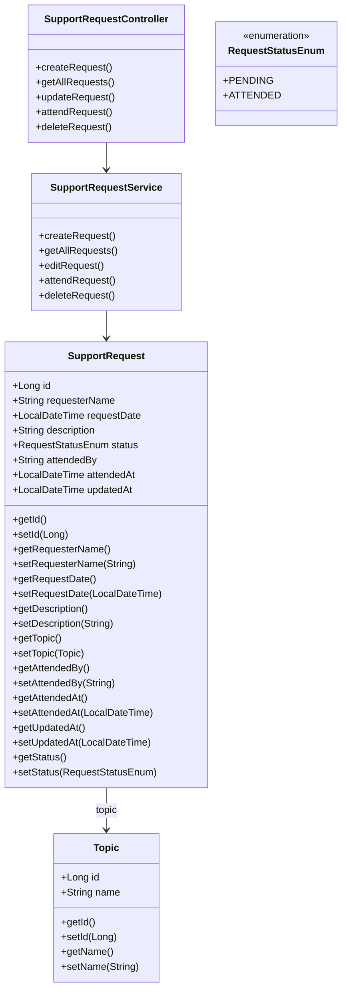
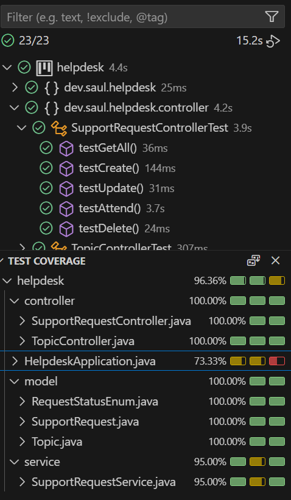

# Helpdesk Support Request Project

## Descripción
Este proyecto es un sistema de gestión de solicitudes de soporte técnico. Permite que los usuarios creen solicitudes y que el departamento técnico las gestione, incluyendo atención, edición y eliminación, cumpliendo los requisitos establecidos.

## Requisitos y cumplimiento
- La solicitud contiene: nombre del solicitante, fecha de la solicitud, tema de la consulta y descripción ✅
- El Frontend puede solicitar la lista de temas de consulta preestablecida ✅
- El departamento técnico puede listar todas las solicitudes en orden de creación (ASC) ✅
- Se indica si una solicitud está pendiente de asistencia ✅
- Se puede marcar una solicitud como atendida y registrar quién la atendió ✅
- Se guarda la fecha y hora de la asistencia ✅
- El departamento técnico puede editar una solicitud existente ✅
- Se registra la fecha y hora de edición de la solicitud ✅
- Se puede eliminar una solicitud solo si ha sido atendida previamente ✅
- Cobertura de tests unitarios >= 70% ✅

## Tecnologías utilizadas
- Java 21 SE
- Spring & Spring Boot
- Spring Data JPA
- Base de datos: H2 / MySQL
- Tests: JUnit 5 + MockMvc

## Diagrama UML

## Tests
- Se han implementado tests unitarios y de integración para cada operación (crear, obtener, actualizar, atender, eliminar)
- Cobertura mínima alcanzada: 70%
- Herramientas: JUnit 5, MockMvc

## Test Coverage

